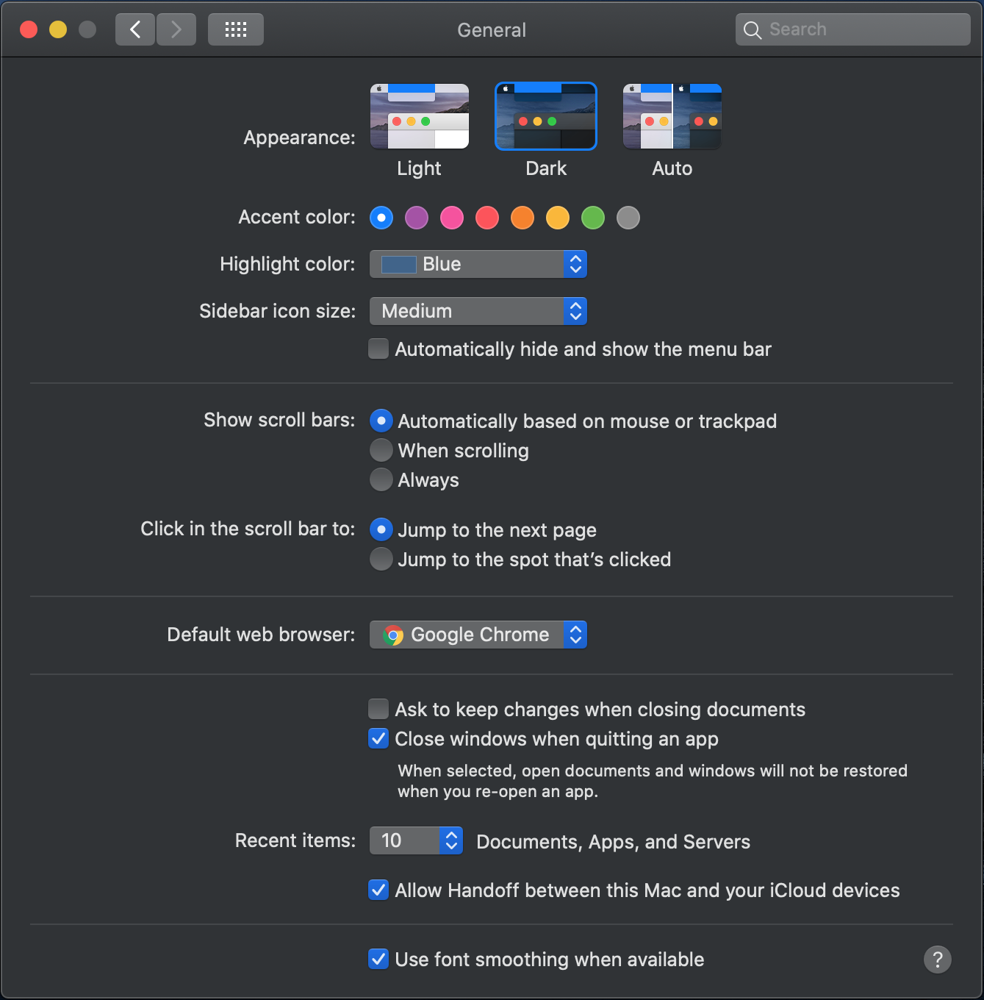

### 1. General

- `Appearance` > `Dark` : 다크 모드를 사용하면 눈에 피로감이 덜하다.
- `Show scroll bars` > `Automatically based on mouse or trackpad` 로 설정하면 필요할 때만 스크롤 막대가 보여 화면이 깔끔하다.
- `Default web browser` : 크롬으로 지정

### 2. Dock

- `Size`를 줄여 Dock이 차지하는 공간을 줄인다.
- `Automatically hide and show the Dock`을 활성화하여 필요하지 않을 때에는 Dock을 숨긴다.
- `Show recent application in Dock` 을 비활성화시킨다. 사용한 프로그램들이 자꾸 Dock에 쌓여서 늘어나는 것이 개인적으로 지저분해서 좋아하지 않는다.

### 3. Mission Control

- `Automatically rearrange Spaces based on most recent use`를 비활성화한다. 사용 내역에 따라 의도하지 않게 순서가 변경될 수 있어 꺼두는 것이 좋다.

### 4. Language & Region

- `Preferred languages`를 `English > 한국어` 순으로 설정한다. 에러 메세지가 영어로 나와 검색이 더 수월하다.

### 5. Accessibility

- `Pointer Control` > `Mouse & Trackpad` > `Trackpad Options` > `Enable dragging` 을 `three finger drag` 로 설정한다. 트랙패드를 누르지 않고 창 이동을 할 수 있어 편리하다.

### 6. Security & Privacy

- `General` > `Require password 'immediately' after sleep or screen saver begins` : 개인 컴퓨터라면 크게 중요하지 않을 수도 있지만, 회사 컴퓨터인 경우에 언제나 패스워드 입력을 하도록 해서 보안을 강화한다.
- `FileVault` > `Turn On FileVault` : 분실 시 복구가 불가능하도록 SSD 내의 데이터들을 암호화하는 기능이다. 예전에는 성능 이슈가 있었으나 요즘에는 속도 차이를 체감하기 어렵다고 한다.

### 7. Bluetooth

- `Show Bluetooth in menu bar`를 활성화한다. 외장 기기 연결 관리하기 편하다.

### 8. Sound

- `Sound Effects` > `Show volume in menu bar`를 활성화한다. 외장 모니터나 에어팟 연결 시 소리를 어느 기기에서 출력할지 메뉴바에서 수정하기 편하다.

### 9. Keyboard

- `Keyboard` > `Key Repeat`은 제일 빠르게 설정한다. 쉘에서 백스페이스로 글자 지워야 할 때 빠르게 지울 수 있어 최근에 바꿨다.
- `Text` > `Correct spelling automatically` , `Capitalize words automatically`,  `Add period with double-space` , `Touch Bar typing suggestions` 를 비활성화한다.
- `Input Sources` > `Use the 한/영 key to switch to and from ABC` 를 활성화한다. 신형 맥북에서는 이게 default 인데, 내 맥북은 구형이라 Caps Lock 키로 한영 전환되도록 설정해야했다.

### 10. Trackpad

- `Point & Click` > `Tap to click` 을 활성화한다. 트랙패드에 물리적 압력을 가하지 않고 터치만으로 클릭 기능을 사용할 수 있어 손목에 부담이 덜 간다.
- `Point & Click` > `Tracking speed` 는 제일 빠르게 설정한다. 이 역시 손가락을 조금만 움직여도 동작 범위가 넓어 손목에 부담이 덜 간다.
- `More Gestures` > `Swipe between full-screen apps` 를 `Swipe left or right with four fingers` 로 변경한다. 세 손가락을 드래그를 위해 남겨둔다.

### 11. Date & Time

- `Clock` > `Date options` > `Show date`를 활성화한다. 메뉴바에서 날짜를 확인할 수 있어 은근 편하다.

### 12. 배터리 잔량 표시

- 메뉴바의 배터리 아이콘을 클릭해서 `Show Percentage`를 활성화한다. 퍼센트 단위로 확인할 수 있는 게 마음이 편하다.
