오라클(Oracle)에서 Mac OS용 데이터베이스 프로그램을 제공하지 않기 때문에, Mac에서 오라클 데이터베이스를 사용하기 위해서는 도커(Docker)를 이용해야 한다.

<br>

설치는 아래의 순서로 진행하면 된다.

- Docker 설치
- Oracle 11g 설치
- SQLPlus 실행
- SQL Developer 설치 및 실행

<br>

### 1. 도커 설치

나는 homebrew cask를 이용해 설치했다.
`brew cask`를 이용하면 `Docker Desktop on Mac` 도커와 `docker-compose`, `docker-machine`을 같이 설치해준다.

```sh
brew install docker --cask
```

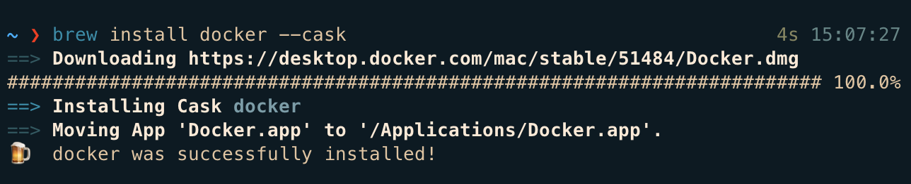

기존 `brew cask install` 방식은 [deprecated](https://github.com/ansible-collections/community.general/issues/1524)되었다. 2.7 버전부터는 `--cask` 옵션을 사용해야 한다.

도커 실행 후, 로그인을 한다.

```sh
docker login
```

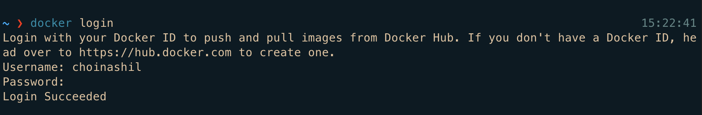

<br>

### 2. Oracle 11g 설치

```sh
docker search oracle-xe
```

이렇게 검색해보면 이미지들이 많이 나오는데, 이 중에서 [deepdiver의 docker-oracle-xe-11g](https://hub.docker.com/r/deepdiver/docker-oracle-xe-11g)를 설치했다.

```sh
docker pull deepdiver/docker-oracle-xe-11g
```

<br>

이미지를 다운받았다면 컨테이너로 생성한 뒤 실행한다.

```sh
docker run --name oracle11g -d -p 49160:22 -p 49161:1521 deepdiver/docker-oracle-xe-11g
```

- `run`: 컨테이너 실행
- `--name oracle11g`: 컨테이너 이름을 oracle11g로 설정
- `-d`: 백그라운드에서 컨테이너를 실행시키는 옵션 (detached mode)
- `-p`: 호스트와 컨테이너의 포트 연결
- `-v {path}`: 호스트와 컨테이너의 디렉토리 연결. -v 옵션을 추가하면 컨테이너 종료 시 데이터를 외부에 저장할 수 있다. (사용 안함)

<br>
<br>

나는 실행하려고 하니 이미 사용 중인 포트라고 해서, 포트를 죽이고 다시 시도했다.

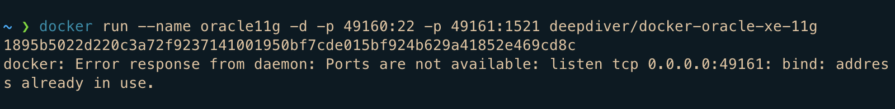
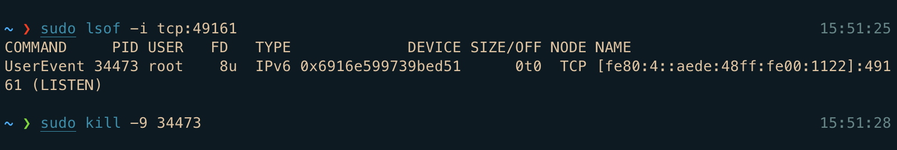

<br>
컨테이너가 생성되었으면 제대로 실행 중인지 아래 명령어로 확인한다.

```sh
docker ps
```

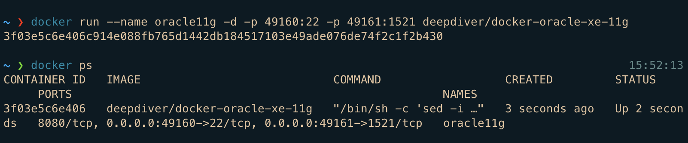

나중에 다시 실행하고 싶을 때는

```sh
docker restart oracle11g
```

명령어를 사용하면 된다.

<br>

### 3. SQLPlus 실행

컨테이너가 실행되고 있는 상태에서 아래 명령어로 SQLPlus에 접속한다.

```sh
docker exec -it oracle11g sqlplus
```

<br>

user-name은 `system`, password는 `oracle`이라고 입력한다.
처음 로그인 시 초기값이다.

아래 이미지처럼 나온다면 설치가 잘 된 것이다.

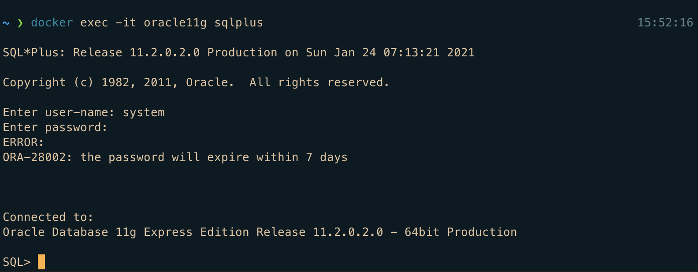

종료는 `exit` 명령어를 사용한다.

<br>

### 4. SQL Developer 설치 및 실행

SQL Developer를 사용한다면 [오라클 사이트](https://www.oracle.com/tools/downloads/sqldev-v192-downloads.html)에서 SQL Developer Mac용을 다운받는다. 회원가입 또는 로그인을 진행해야 한다.

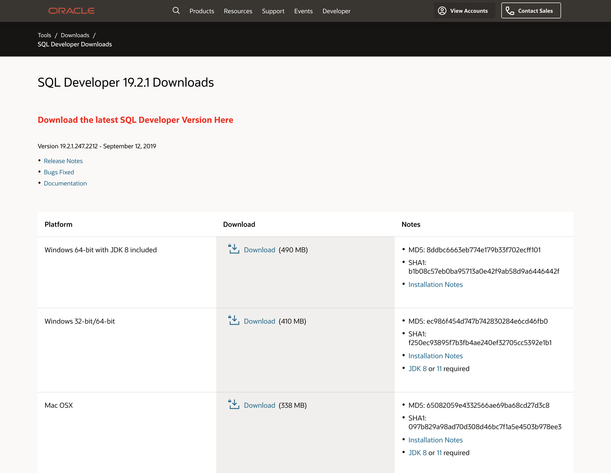

다운받은 SQL Developer를 실행하려고 하면, 아래와 같이 Java를 설치하라는 alert이 뜬다.

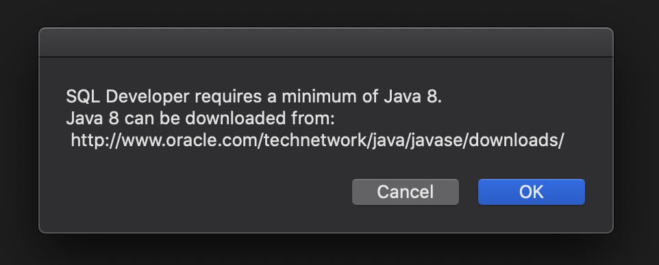
SQL Developer를 사용하려면 Java 버전 8 또는 11을 설치해야 하기 때문이다. 나는 [여기](https://www.oracle.com/java/technologies/javase/javase-jdk8-downloads.html)서 버전 8을 다운받았다.

(예전에 다른 Mac에 11로 받았을 때는 문제가 없었는데, 이번에는 11을 다운받으니 SQL Developer가 자꾸 종료되는 이슈가 있어 8로 다시 설치하니 잘 작동했다.)

<br>

SQL developer가 실행되었다면 아래 이미지를 참고하여 접속한다.

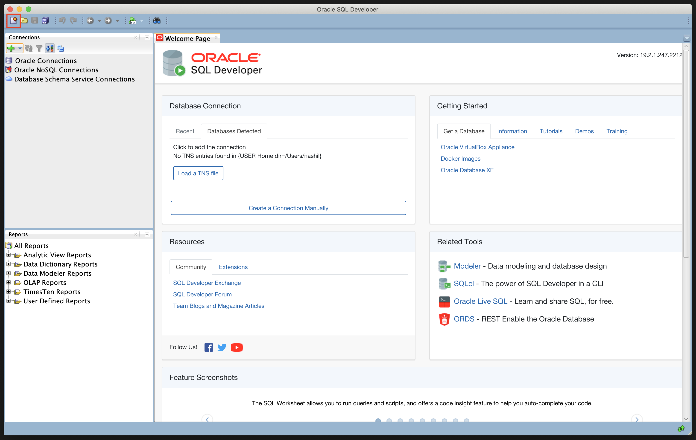
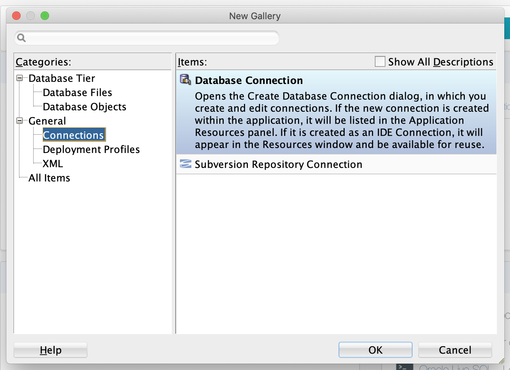
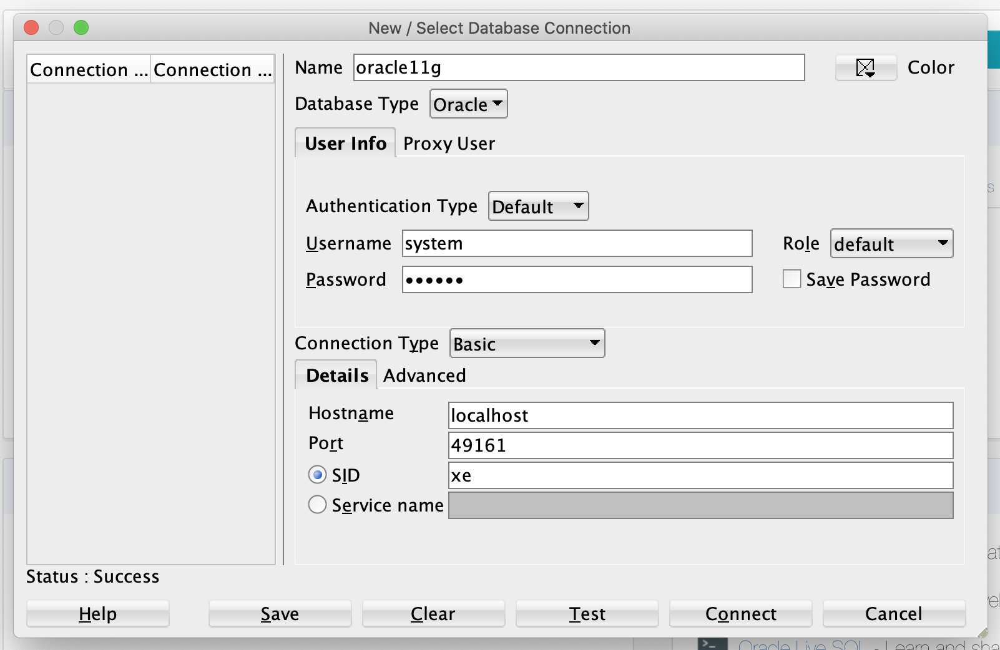

- Name: 원하는 이름 지정
- 사용자 이름: `system` (초기값)
- 비밀번호: `oracle` (초기값)
- 호스트 이름: localhost
- 포트: `docker ps`로 오라클 1521포트와 연결된 포트를 확인 후 적어준다 (ex. 49161)

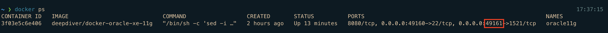

잘 입력했으면 `Test` 버튼을 눌러 접속 테스트를 해보고, 테스트가 성공했으면 접속한다.

그러면 아래와 같이 초기 비밀번호 변경에 대한 안내가 나온다.

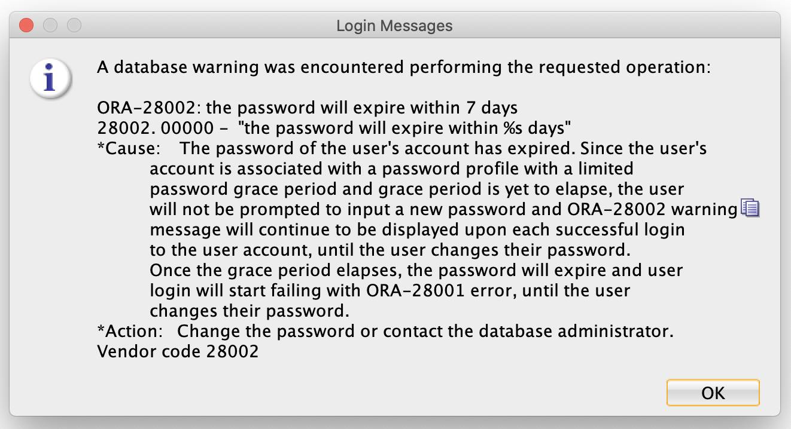

아래 이미지를 참고하여 새로운 비밀번호로 변경해준다.

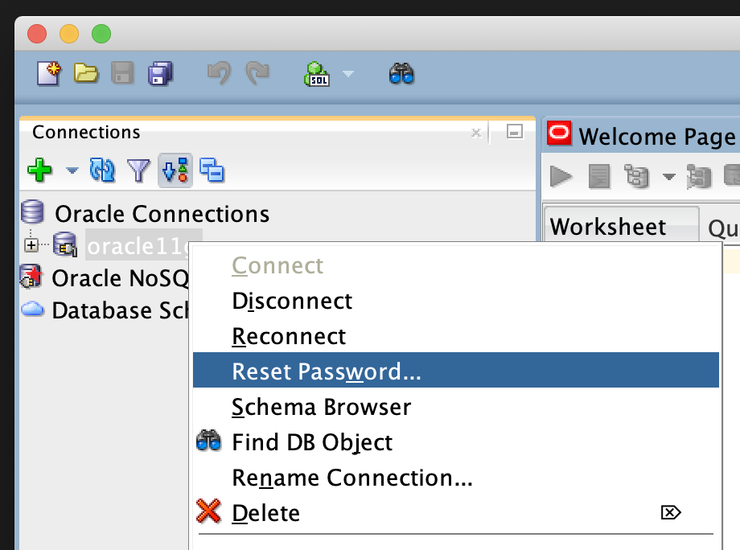
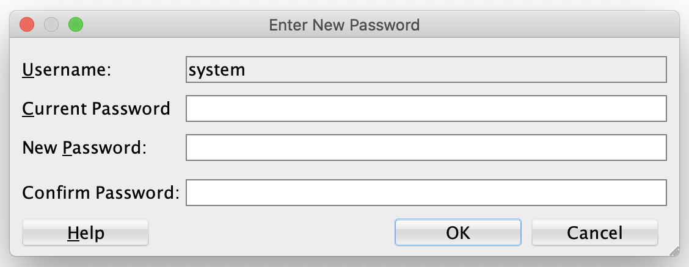

<br>

그리고 내가 사용할 새로운 유저와 데이터베이스를 만든다.

```SQL
CREATE USER username
IDENTIFIED BY password;

GRANT DBA TO username;
```

으로 유저를 만들고 권한을 부여한 뒤, 아까 했던 방법으로 데이터베이스를 생성하면 된다.
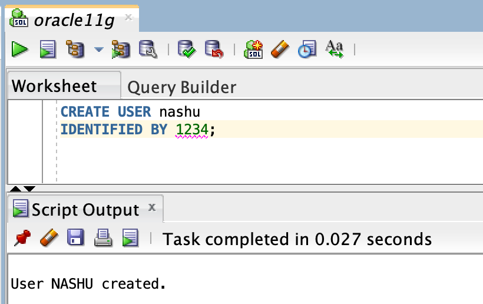
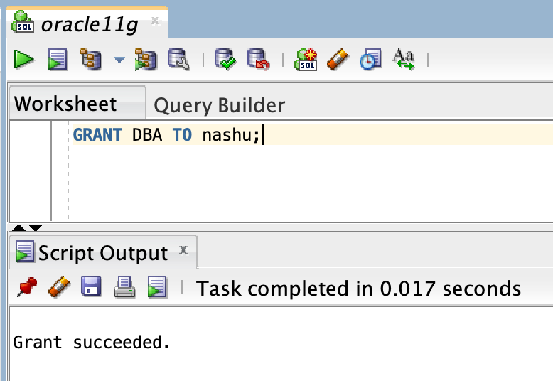
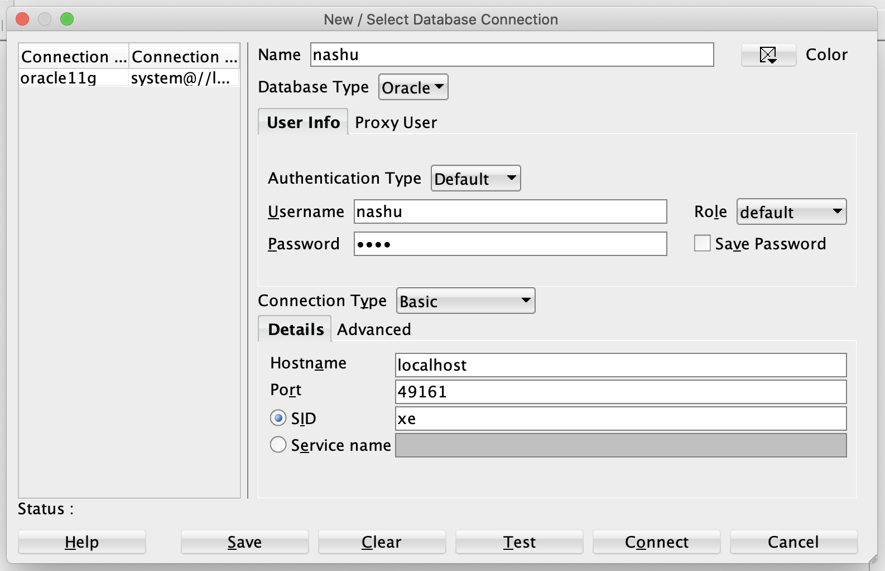

<br>

### Reference

- [[Docker] Homebrew로 Mac에 도커 설치](https://dc7303.github.io/docker/2019/11/24/dockerInstallForMac/) - brew로 도커 설치
- [[맥] 맥에 오라클&SQL Developer 설치하기](https://namubada.net/282) - 도커 명령어 참고
- [[Docker] 도커를 이용한 맥OS 오라클DB 설치 :: 마이자몽](https://myjamong.tistory.com/106) - SQL Developer 설치 및 접속
- [맥OS MOJAVE에서 도커로 오라클 설치하기](https://coding-restaurant.tistory.com/124) - 새 계정 만들기, Locale not recognized 에러 해결방법
- [맥북 OSX에서 오라클 데이터베이스 설치하기 쉽게!](https://m.blog.naver.com/PostView.nhn?blogId=yyj9301&logNo=221256974481&proxyReferer=https:%2F%2Fwww.google.com%2F) - v옵션 사용 시 참고
- [예제로 배우는 ORACLE 11g](https://wikidocs.net/3905) - 데이터베이스, SQL 등 예제 중심 글 모음
- [Error starting userland proxy: listen tcp 0.0.0.0:2049: bind: address already in use
  ](https://stackoverflow.com/questions/55535967/error-starting-userland-proxy-listen-tcp-0-0-0-02049-bind-address-already-in) - 사용 중인 포트 죽이기
